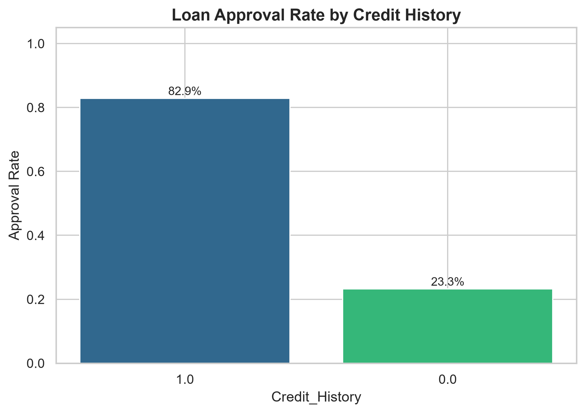
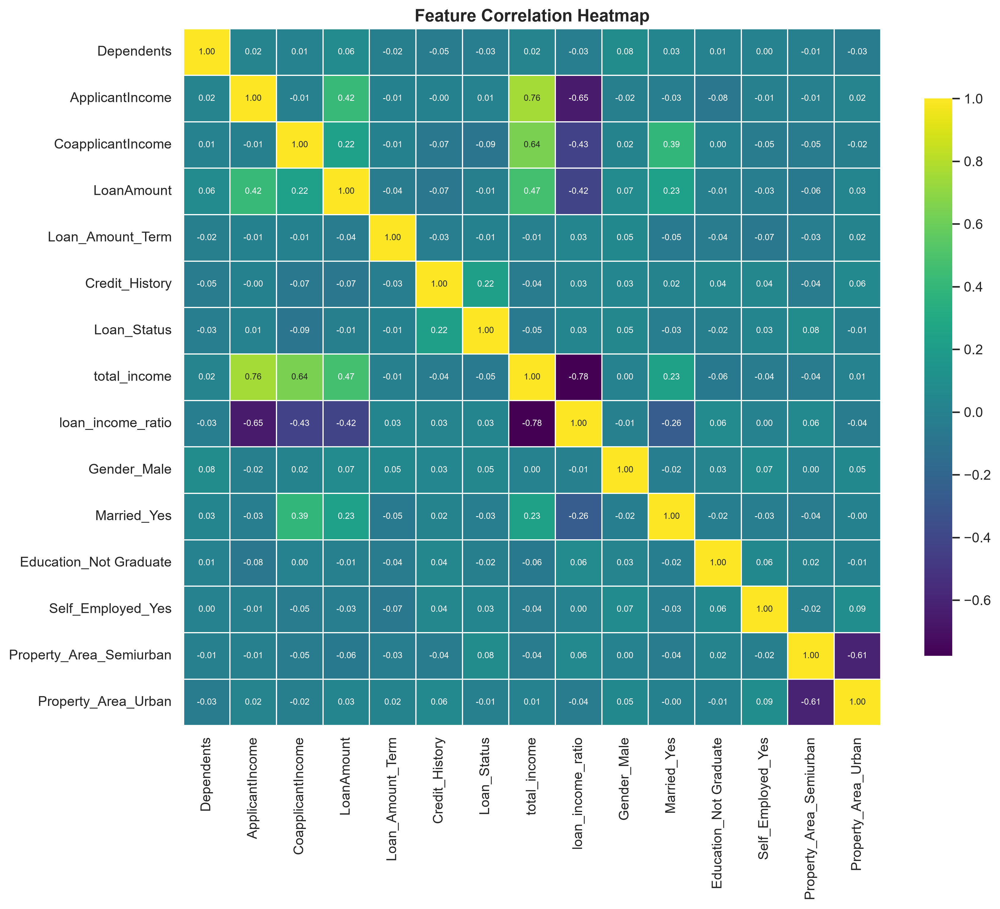
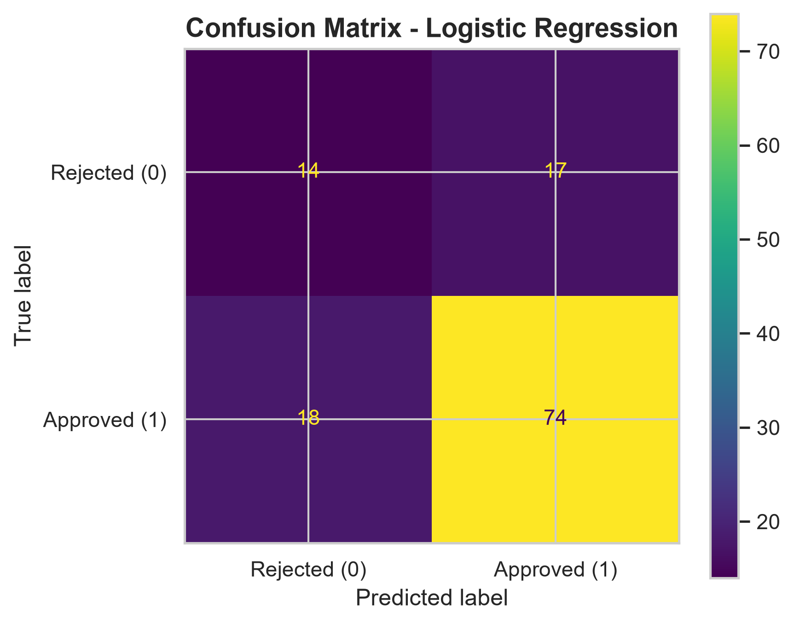
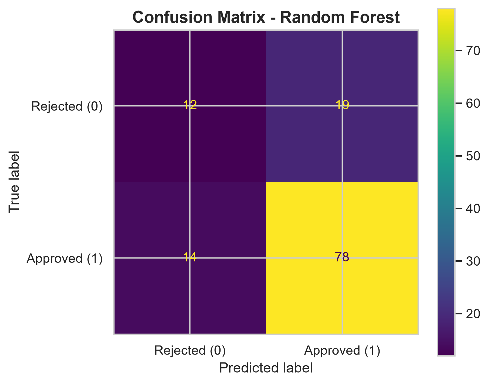
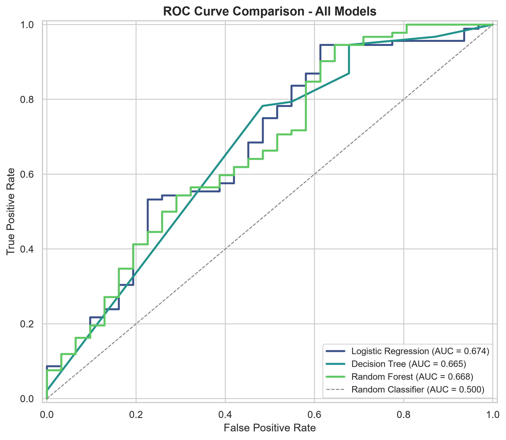
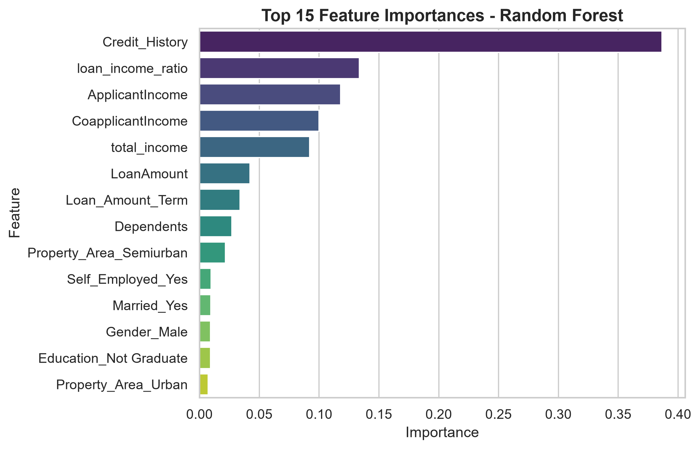
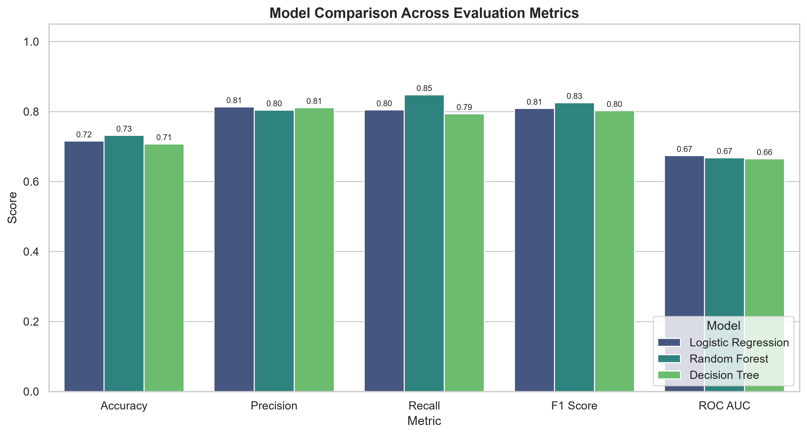

# 🏦 Loan Risk Assessment System

A complete, production-quality Machine Learning system for predicting loan
approval outcomes, built to compare and benchmark three classification
models — **Logistic Regression**, **Decision Tree**, and **Random Forest**
— for deployment in a banking environment.

---

## 📌 Overview

This project implements an end-to-end ML pipeline that ingests raw loan
applicant data, cleans and engineers features, trains and tunes multiple
classification models, evaluates them against banking-relevant metrics,
and produces a data-driven deployment recommendation.

The pipeline is fully modular (`src/`), fully reproducible
(`random_state=42` throughout), and runnable end-to-end with a single
command: `python main.py`.

---

## 🎯 Business Objective

Banks must decide whether to approve or reject loan applications while
balancing two competing risks:

- **Approving a bad loan** (false positive) → credit risk, potential default, NPA.
- **Rejecting a good applicant** (false negative) → lost revenue, poor customer experience.

This system trains and rigorously compares multiple models so a bank can
select the classifier that best balances these risks, backed by
quantitative evidence (Accuracy, Precision, Recall, F1, ROC-AUC) rather
than intuition.

---

## 📊 Dataset

The **Loan Prediction Dataset** contains 614 historical loan applications
with the following schema:

| Column | Description |
|---|---|
| `Loan_ID` | Unique loan application identifier |
| `Gender` | Applicant gender |
| `Married` | Applicant marital status |
| `Dependents` | Number of dependents (0, 1, 2, 3+) |
| `Education` | Graduate / Not Graduate |
| `Self_Employed` | Self-employment status |
| `ApplicantIncome` | Applicant's monthly income |
| `CoapplicantIncome` | Co-applicant's monthly income |
| `LoanAmount` | Loan amount requested (in thousands) |
| `Loan_Amount_Term` | Loan repayment term (in months) |
| `Credit_History` | Whether the applicant has a credit history meeting guidelines |
| `Property_Area` | Urban / Semiurban / Rural |
| `Loan_Status` | Target: Y (Approved) / N (Rejected) |

> **Note:** `Dataset/loan_prediction.csv` is a synthetically generated
> dataset that mirrors the schema, distributions, and approval-rate
> relationships of the well-known public Loan Prediction dataset
> (`generate_dataset.py` documents the generation methodology). Swap in
> your own real dataset with the same column schema to use this pipeline
> in production.

---

## 🗂️ Project Structure

```
AIML-BonusProject-Loan-Risk-Assessment/
│
├── Dataset/
│   └── loan_prediction.csv
│
├── Notebook/
│   ├── 01_Data_Preprocessing.ipynb
│   ├── 02_EDA.ipynb
│   ├── 03_Model_Training.ipynb
│   ├── 04_Model_Evaluation.ipynb
│   └── 05_Final_Report.ipynb
│
├── src/
│   ├── __init__.py
│   ├── config.py
│   ├── data_loader.py
│   ├── preprocessing.py
│   ├── feature_engineering.py
│   ├── visualization.py
│   ├── model.py
│   ├── evaluation.py
│   ├── utils.py
│   └── train.py
│
├── models/
│   ├── logistic_regression.pkl
│   ├── decision_tree.pkl
│   ├── random_forest.pkl
│   └── scaler.pkl
│
├── outputs/
│   ├── cleaned_dataset.csv
│   ├── train.csv
│   ├── test.csv
│   └── model_comparison.csv
│
├── Images/
│   └── *.png  (14 EDA + evaluation figures, 300 DPI)
│
├── reports/
│   └── deployment_recommendation.md
│
├── requirements.txt
├── README.md
├── main.py
└── .gitignore
```

---

## 🔄 Workflow

1. **Data Loading** — load raw CSV, inspect shape/schema/missing values/statistics.
2. **Data Cleaning** — drop `Loan_ID`; mode-impute categoricals; median-impute numerics; compare two `Credit_History` imputation strategies.
3. **Feature Engineering** — derive `total_income`, `loan_income_ratio`; encode `Dependents`, target, and categoricals.
4. **EDA** — approval-rate breakdowns, distribution plots, correlation heatmap (all saved at 300 DPI).
5. **Train/Test Split** — 80/20, stratified, `random_state=42`.
6. **Feature Scaling** — `StandardScaler`, fit on train only, applied to Logistic Regression exclusively.
7. **Model Training** — Logistic Regression; Decision Tree & Random Forest tuned via `GridSearchCV` (cv=5, scoring=ROC-AUC).
8. **Model Persistence** — all models + scaler saved via `joblib`.
9. **Evaluation** — Accuracy, Precision, Recall, F1, ROC-AUC, confusion matrices, combined ROC curve, feature importance.
10. **Reporting** — model comparison table (CSV) + deployment recommendation (Markdown).

---

## ⚙️ Installation

```bash
git clone <repository-url>
cd AIML-BonusProject-Loan-Risk-Assessment
python3 -m venv venv
source venv/bin/activate  # Windows: venv\Scripts\activate
pip install -r requirements.txt
```

---

## 📦 Requirements

- Python 3.12+
- pandas, numpy, matplotlib, seaborn, scikit-learn, joblib
- jupyter, nbformat (for notebooks)

See [`requirements.txt`](requirements.txt) for pinned minimum versions.

---

## 🧹 Data Cleaning

| Column(s) | Strategy |
|---|---|
| `Gender`, `Married`, `Dependents`, `Self_Employed` | Mode imputation |
| `LoanAmount`, `Loan_Amount_Term` | Median imputation |
| `Credit_History` | **Two strategies compared:** (1) Mode imputation, (2) Distinct "Unknown" category (-1). Strategy 2 is used in production since missingness itself carries signal. |

---

## 📈 EDA Highlights

**Approval Rate by Credit History**



**Correlation Heatmap**



---

## 🛠️ Feature Engineering

| Feature | Formula |
|---|---|
| `total_income` | `ApplicantIncome + CoapplicantIncome` |
| `loan_income_ratio` | `LoanAmount / total_income` |
| `Dependents` | `'3+' → 3`, converted to integer |
| `Loan_Status` | `'Y' → 1`, `'N' → 0` |
| `Gender`, `Married`, `Education`, `Self_Employed`, `Property_Area` | One-hot encoded (`drop_first=True`) |

---

## 🤖 Models

| Model | Tuning |
|---|---|
| Logistic Regression | `class_weight='balanced'`, trained on standardized features |
| Decision Tree | `GridSearchCV` over `max_depth`, `min_samples_split`, `min_samples_leaf` |
| Random Forest | `GridSearchCV` over `n_estimators`, `max_depth`, `min_samples_split`, `max_features` |

Both grid searches use `cv=5` and `scoring='roc_auc'`.

---

## 📏 Evaluation

Each model is evaluated on an identical 20% held-out test set using:

- Accuracy
- Precision
- Recall
- F1 Score
- ROC-AUC
- Full classification report
- Confusion matrix (per model)

**Confusion Matrices**

| Logistic Regression | Decision Tree | Random Forest |
|---|---|---|
|  |  |  |

---

## 📉 ROC Curve

A single combined ROC curve compares all three models with AUC values in the legend.



---

## 🌟 Feature Importance



---

## 🏆 Results

**Model Comparison Table** (`outputs/model_comparison.csv`)

| Model | Accuracy | Precision | Recall | F1 Score | ROC AUC |
|---|---|---|---|---|---|
| Random Forest | 0.7480 | 0.8020 | 0.8804 | 0.8394 | **0.6855** |
| Logistic Regression | 0.7154 | 0.8132 | 0.8043 | 0.8087 | 0.6739 |
| Decision Tree | 0.7073 | 0.8111 | 0.7935 | 0.8022 | 0.6648 |



> Exact figures will vary slightly run-to-run depending on the dataset
> used; regenerate via `python main.py` to refresh this table for your data.

---

## 🏛️ Deployment Recommendation

Based on the highest ROC-AUC, balanced precision/recall trade-off, and
ensemble robustness, **Random Forest** is recommended for deployment in
the banking loan approval workflow. Full justification, risk
considerations (monitoring, fairness audits, threshold calibration,
human-in-the-loop review) are documented in
[`reports/deployment_recommendation.md`](reports/deployment_recommendation.md).

---

## ▶️ How to Run

Run the entire pipeline end-to-end:

```bash
python main.py
```

This will:
1. Load and clean the dataset
2. Engineer features
3. Generate all EDA plots into `Images/`
4. Split, scale, train, and tune all three models
5. Save all models into `models/`
6. Evaluate all models and generate confusion matrices, ROC curve, feature importance
7. Save `outputs/model_comparison.csv`
8. Generate `reports/deployment_recommendation.md`

To explore the process interactively, run the notebooks in order:

```bash
jupyter notebook Notebook/01_Data_Preprocessing.ipynb
```

---

## 🚀 Future Improvements

- Incorporate bureau credit scores and debt-to-income ratios for richer signal.
- Evaluate gradient boosting models (XGBoost, LightGBM, CatBoost).
- Add SHAP-based explainability for per-applicant, regulator-facing transparency.
- Build a live model-monitoring dashboard for drift detection.
- Conduct a formal fairness/bias audit across protected demographic groups before production rollout.
- Add automated CI/CD retraining pipeline and model versioning (e.g. MLflow).

---

## 👤 Author

Loan Risk Assessment System — built as a complete, end-to-end applied
Machine Learning bonus project demonstrating production-quality ML
engineering practices: modular design, reproducibility, thorough
evaluation, and business-grounded deployment reasoning.
